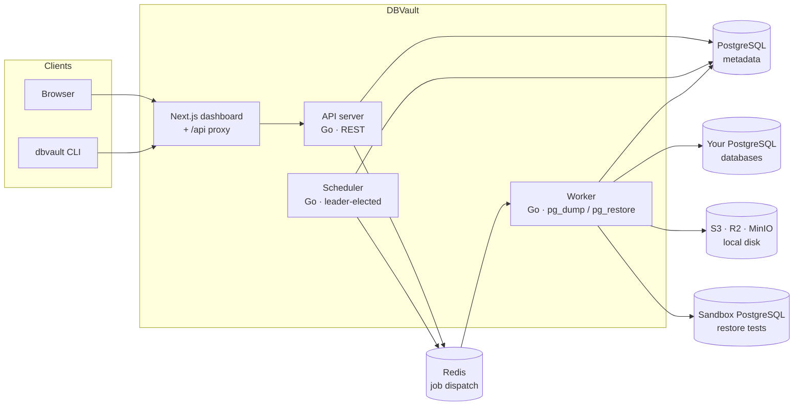
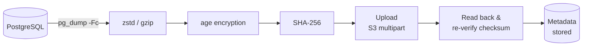

<div align="center">

# DBVault

**Open-source backup infrastructure for SQL databases.**

Automated, encrypted, restore-tested backups of PostgreSQL, MySQL and MariaDB with a clean
dashboard, a CLI and a one-command self-hosted install.

[Quick start](#quick-start) · [Features](#features) · [Architecture](#architecture) · [CLI](#cli) · [Docs](docs/) · [Security](#security)

</div>

---

A backup you haven't restored is just a hope. DBVault runs each engine's native dump tool
(`pg_dump`, `mariadb-dump`) on a schedule, streams the dump through compression and
encryption into the storage you already use (Amazon S3, Cloudflare R2, MinIO or local disk),
verifies every upload with SHA-256, and can **prove** a backup restores by restoring it into
a disposable sandbox of the same engine and querying it.

```console
$ dbvault backup production

Starting backup...

Database:    production
Server:      PostgreSQL 17
Destination: s3-eu (S3)

Uploading...
████████████████████ 100%

Backup completed.

Size:     482.0 MB
Duration: 2m 14s
Checksum: 9f2c4e1a…
```

## Features

| | |
|---|---|
| **Databases** | PostgreSQL 9.2 – 18, MySQL 5.7 – 9 and MariaDB 10 – 11, each with native dump tooling, plus SQLite files from a mounted folder. SQL Server is planned. See [docs/engines.md](docs/engines.md). |
| **Automated backups** | `pg_dump` (custom format) or `mariadb-dump` streamed through zstd/gzip → encryption → SHA-256 → upload in one pass. Memory stays bounded (≈60 MB for a 350 MB database). |
| **Schedules** | Hourly, every 6 hours, daily, weekly or any cron expression, in any timezone. Runs server-side; duplicate runs are impossible by design. |
| **S3 / R2 / MinIO / disk** | One storage abstraction over the S3 API (multipart, adaptive part sizes, aborted on failure) plus a sandboxed local filesystem backend. |
| **Encryption** | Backups are encrypted with [age](https://age-encryption.org) (X25519 + ChaCha20-Poly1305) using a per-organization key. Secrets at rest use AES-256-GCM. No custom crypto. |
| **Checksums** | SHA-256 of every stored artifact, re-verified by reading the object back after upload, and again before every restore. |
| **Restore verification** | Download → checksum → decrypt → decompress → restore into a temporary database of the same engine (Docker container or sandbox server) → query every table → destroy. Honest when unavailable. |
| **Restore** | Into a new database, or over an existing one (type `RESTORE` to confirm). PostgreSQL restores run in a single transaction (all-or-nothing); MySQL/MariaDB can't, and the wizard says so. |
| **Data masking** | Anonymized restores into staging: personal data is replaced with consistent, realistic fakes inside a sandbox, and new unmasked columns stop the run. PostgreSQL and SQLite. See [docs/masking.md](docs/masking.md). |
| **Retention** | Grandfather-father-son policies (daily / weekly / monthly) with a preview of exactly what will be kept and deleted. |
| **Notifications** | Email and HMAC-signed webhooks for failures, successes, restores and storage problems. Slack/Discord-ready sender interface. |
| **Teams & audit log** | Organizations, owner/admin/member/viewer roles, invitations, and an append-only audit log of every sensitive action. |
| **Two-factor sign-in** | TOTP authenticator codes (any authenticator app) with single-use recovery codes, also enforced by `dbvault init`. See [docs/security.md](docs/security.md#two-factor-authentication). |
| **CLI** | `dbvault init`, `backup`, `verify`, `restore`, `status`… for scripts and terminals. |
| **Docker** | `docker compose up -d` gives you the app, API, worker, scheduler, PostgreSQL, Redis, MinIO and Mailpit. |

## Quick start

Requirements: Docker with Compose v2.

```bash
git clone https://github.com/Database-Vault-Tech/dbvault && cd dbvault
cp .env.example .env          # or ./scripts/setup.sh to generate strong secrets (recommended)
docker compose up -d
```

Open **http://localhost:3000**, create an account, and follow the checklist on the dashboard:

1. **Add a database**: pick PostgreSQL, MySQL, MariaDB or SQLite, then host, port,
   credentials and SSL mode (or, for SQLite, the file's path). Click *Test Connection* to
   check it before saving.
2. **Add storage**: one click for the bundled MinIO, or your own S3 / R2 / MinIO bucket.
3. **Create a schedule**: frequency, retention, compression, encryption and optional
   automatic restore tests.
4. **Run a backup**: watch the dump, compression, encryption, upload and checksum
   verification live.

Want sample data to try it on? Start the demo databases too and add one with host
`sample-postgres`, `sample-mysql` or `sample-mariadb`, database `shop`, user `shop`,
password `shop-password`:

```bash
docker compose -f docker-compose.yml -f docker/e2e.yml up -d
```

> **Back up your `ENCRYPTION_KEY`.** It protects every stored credential and every backup
> key. `scripts/setup.sh` writes it to `.env`; if you leave it empty, DBVault generates one
> in the `dbvault-secrets` volume. Also export your organization's recovery key from
> *Settings → Security* so backups stay decryptable even if DBVault itself is lost.

## Architecture

DBVault is a modular monolith: one Go codebase that builds three processes, plus a Next.js
dashboard and a CLI.



- **API** (`backend/cmd/api`): REST API, auth, validation, audit log. Long-running work is
  never done in a request: `POST /api/backups` returns `{ "job_id", "status": "queued" }`.
- **Worker** (`backend/cmd/worker`): claims jobs (backup, restore, verification, cleanup,
  notification) and runs them with heartbeats, cancellation and graceful shutdown.
- **Scheduler** (`backend/cmd/scheduler`): turns due schedules into jobs, re-dispatches lost
  jobs, recovers work from crashed workers, and runs retention.
- **PostgreSQL** is the source of truth for everything, including job state; **Redis** is
  only the dispatch channel (and the rate limiter).

### The backup pipeline



Every arrow is a stream, so a backup never sits in memory or on the worker's disk. If
`pg_dump` fails, its exit status is checked *before* the final compressed frame is written,
so a truncated dump can never be stored as a complete backup. Read more in
[docs/backup-engine.md](docs/backup-engine.md).

Objects get predictable names:

```
<prefix>/production/2026/09/19/backup_2026-09-19_12-30-00.dump.zst.age
```

See [docs/architecture.md](docs/architecture.md) for the data model, job system and
scheduling guarantees.

## Configuration

Everything is configured with environment variables; every one is documented in
[`.env.example`](.env.example). The most important:

| Variable | Purpose |
|---|---|
| `APP_URL` | Public URL of the dashboard (links in emails, CSRF origin check). |
| `ENCRYPTION_KEY` | 32 random bytes (base64). Master key for credentials and backup keys. **Back it up.** |
| `AUTH_SECRET` | 32+ chars. Signs CSRF tokens and keys session/API-token hashes. |
| `DATABASE_URL`, `REDIS_URL` | DBVault's own PostgreSQL and Redis (set automatically in compose). |
| `S3_*` | The built-in MinIO bucket offered as one-click storage. |
| `SQLITE_HOST_DIR` | Host folder with SQLite files to protect, mounted at `/sqlite` (`SQLITE_ROOT`). Default `./data/sqlite`; must be read/write for uid 10001. |
| `VERIFY_MODE` | `server` (default), `docker` or `disabled` — how restore tests run. |
| `VERIFY_POSTGRES_URL`, `VERIFY_MYSQL_URL`, `VERIFY_MARIADB_URL` | Verification servers per engine for `VERIFY_MODE=server` (set in compose). |
| `PG_BIN_DIR`, `MYSQL_BIN_DIR` | Where the worker finds `pg_dump`/`pg_restore` and `mariadb-dump`/`mariadb` when they're not on `PATH`. |
| `SMTP_*` | Email for notifications, invitations and password resets (Mailpit locally). |
| `WORKER_CONCURRENCY` | Parallel jobs per worker. |
| `ALLOW_REGISTRATION` | Turn off open sign-up after creating the first account. |
| `LANDING_PAGE` | `true` shows the marketing page at `/`; by default `/` goes straight to sign-in. |
| `INSTANCE_ADMIN_EMAILS` | Comma-separated emails that get the read-only *Instance admin* view of every organization. |

## Deploying

`docker-compose.prod.yml` runs the stack from published images instead of
building from source:

```bash
DBVAULT_IMAGE_BACKEND=<namespace>/dbvault-backend \
DBVAULT_IMAGE_FRONTEND=<namespace>/dbvault-frontend \
DBVAULT_IMAGE_TAG=latest \
  docker compose -f docker-compose.yml -f docker-compose.prod.yml up -d --wait
```

The `Deploy` workflow does this for you: it builds both images, pushes them to
Docker Hub and rolls the stack over on your server via SSH, rolling back to the
previous tag if the new one doesn't come up healthy. Server setup and the list
of GitHub secrets to configure: [docs/deployment.md](docs/deployment.md).

## Storage

| Provider | What you need |
|---|---|
| **Amazon S3** | Bucket, region (e.g. `eu-west-1`), access key with `s3:PutObject/GetObject/DeleteObject/ListBucket` and multipart permissions. Optional custom endpoint for other S3-compatible services. |
| **Cloudflare R2** | Account ID, bucket, R2 API token (access key + secret). The endpoint `https://<account>.r2.cloudflarestorage.com` is derived for you. |
| **MinIO** | Endpoint (e.g. `http://minio:9000`), bucket, access key. Docker Compose creates a bucket-scoped service account automatically. |
| **Local filesystem** | A directory under `LOCAL_STORAGE_ROOT` on the worker/API volume. Paths can't escape the root. |

Every destination is tested with a write/read/delete round trip before it's used.
Credentials are sealed with AES-256-GCM and never returned by the API. Full setup guides,
including IAM policies: [docs/storage.md](docs/storage.md).

## Backups, restore & verification

- **Manual backups** from the dashboard, the CLI (`dbvault backup production`) or the API.
  Manual backups are never deleted by retention.
- **Scheduled backups** follow the schedule's retention policy. A run is skipped (and logged)
  rather than stacked if the previous backup of that database is still running.
- **Verify** runs a full recovery drill in a sandbox and reports each step:

  ```
  Backup integrity         PASS
  Restore test             PASS
  Database verification    PASS
  Recovery test duration   2m 41s
  ```

  If no sandbox is available the result is **"Restore testing unavailable in this
  environment"**, never a pass.
- **Restore** into a new database (safe) or over the existing one (destructive; type
  `RESTORE` to confirm). The restore runs in a single transaction, so a failure leaves the
  target untouched.

Details: [docs/restore.md](docs/restore.md).

## CLI

```bash
cd cli && go build -o dbvault . && sudo mv dbvault /usr/local/bin/
```

```
dbvault init                          # connect to your server (email/password or --token)
dbvault status                        # workers, restore testing, backup health
dbvault database list | add | remove <name> | test <name>
dbvault backup <database>             # back up now, with live progress
dbvault backup list [--database name]
dbvault backup verify <backup-id>     # full restore test
dbvault restore <backup-id> --new-database copy_of_prod
dbvault restore <backup-id> --existing    # asks you to type RESTORE
dbvault storage list
dbvault schedule list
dbvault version
```

Every command supports `--json`. In CI use `DBVAULT_SERVER`, `DBVAULT_TOKEN` and
`DBVAULT_ORG` instead of `dbvault init`. API tokens are created in
*Settings → Security*.

## Security

DBVault is built as security-sensitive infrastructure:

- argon2id password hashing; opaque, revocable, HttpOnly sessions; signed CSRF tokens plus
  Origin and content-type checks; Redis-backed rate limiting.
- Organization isolation on every query; owner/admin/member/viewer roles; non-members get
  `404`, never `403`, so ids can't be probed.
- Database passwords, storage keys and webhook URLs are encrypted at rest (AES-256-GCM with
  per-row associated data) and never returned by the API or written to logs.
- Backups are encrypted before they leave the worker; storage providers only ever see
  ciphertext.
- Credentials reach `pg_dump` through the child process environment, never argv; child
  processes don't inherit DBVault's own secrets.
- Append-only audit log for logins, credential changes, backups, restores, downloads and
  key exports.

Read the full model in [docs/security.md](docs/security.md). Report vulnerabilities
privately: [SECURITY.md](SECURITY.md).

## Development

```bash
./scripts/setup.sh
docker compose up -d postgres redis minio minio-init verify-postgres verify-mysql verify-mariadb mailpit
# terminal 1-3: backend processes (see docs/development.md for the env to export)
cd backend && go run ./cmd/api
cd backend && go run ./cmd/worker
cd backend && go run ./cmd/scheduler
# terminal 4: dashboard with hot reload
cd frontend && npm install && API_URL=http://localhost:8080 npm run dev
```

Full guide, including running against your own PostgreSQL: [docs/development.md](docs/development.md).

## Testing

| Suite | Command |
|---|---|
| Backend unit tests | `cd backend && go test ./...` |
| Backend integration (real PostgreSQL, MySQL, MariaDB, Redis, MinIO and dump tools) | `./scripts/test-integration.sh` |
| CLI | `cd cli && go test ./...` |
| Frontend unit/component tests | `cd frontend && npm test` |
| Lint & types | `go vet ./...`, `npm run lint`, `npm run typecheck` |
| End-to-end (full stack, real browser) | `docker compose -f docker-compose.yml -f docker/e2e.yml up -d && cd frontend && npm run test:e2e` |

The integration suite creates sample data, backs it up through the real pipeline, verifies
the checksum, restores into a fresh database and compares the data, and also covers
authentication, authorization, tenant isolation, storage failures, corrupted artifacts and
job-queue guarantees. The end-to-end test drives the whole product in a browser: register →
login → add database → test connection → add storage → create schedule → run backup →
verify → restore → backup history.

## Contributing

Contributions are welcome. Read [CONTRIBUTING.md](CONTRIBUTING.md) and our
[Code of Conduct](CODE_OF_CONDUCT.md). Good first areas: new storage providers, Slack and
Discord notification senders, more database version coverage in CI, and new engine drivers
(SQL Server) — see [docs/engines.md](docs/engines.md).

## Roadmap

- Slack, Discord and PagerDuty notification channels
- Point-in-time recovery (WAL archiving) alongside logical dumps
- Per-database `pg_dump` options (include/exclude schemas and tables)
- Backup copies to a second destination (3-2-1 rule)
- OpenID Connect / SAML single sign-on
- Prometheus metrics endpoint
- Helm chart
- **DBVault Cloud**: managed workers, multi-region storage, usage-based billing

## License

[Apache License 2.0](LICENSE). © The DBVault Authors.
