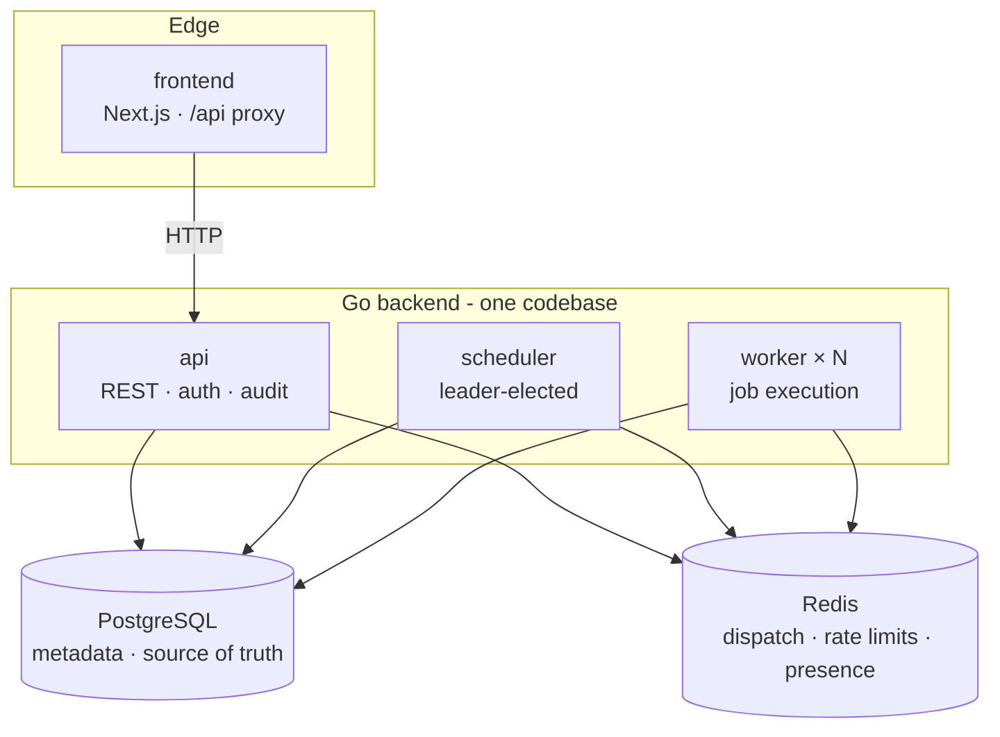
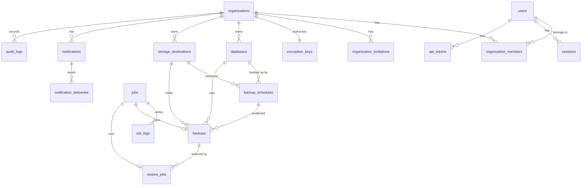
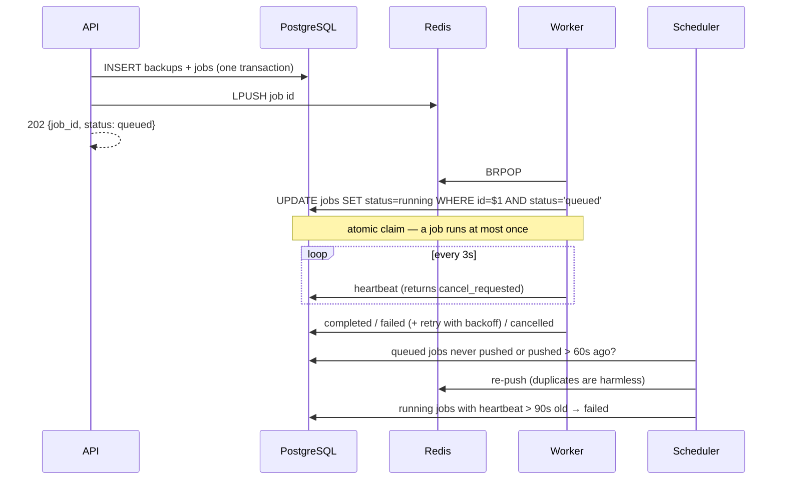

# Architecture

DBVault is a **modular monolith**: a single Go module (`backend/`) that compiles into three
processes sharing all domain code, a Next.js dashboard (`frontend/`) and a thin CLI
(`cli/`). There are no microservices to coordinate; scaling means running more workers.



## Processes

| Process | Binary | Responsibilities |
|---|---|---|
| API | `dbvault-api` | REST API, authentication, authorization, validation, audit logging, migrations on start, streaming downloads. Never runs long jobs. |
| Worker | `dbvault-worker` | Executes `backup`, `restore`, `verification`, `cleanup` and `notification` jobs. Health endpoint on `:8081` (`/health`, `/ready`, `/status`). |
| Scheduler | `dbvault-scheduler` | Queues scheduled backups, re-dispatches lost jobs, reaps jobs of crashed workers, runs retention hourly, purges expired sessions. Health on `:8082`. |
| Frontend | Next.js | Landing page and dashboard. `/api/*` is streamed to the Go API by a route handler (`API_URL` is read at runtime). |

## Package layout

```
backend/
  cmd/{api,worker,scheduler}   entry points
  migrations/                  embedded SQL migrations
  internal/
    app/            wires every service (shared by all binaries)
    api/            router, middleware (request id, logging, recovery, security headers)
    auth/           argon2id, sessions, API tokens, CSRF, roles
    organizations/  orgs, membership, invitations, recovery-key export
    database/       protected databases: CRUD, connection testing, libpq targets
    storage/        Storage interface; local + S3-compatible implementations; destinations
    backups/        backup engine (streaming pipeline), records, downloads, retention cleanup
    restore/        restore engine, verification sandboxes (docker, server)
    scheduler/      schedules CRUD, cron handling, the scheduling runner
    jobs/           PostgreSQL-backed job queue with Redis dispatch
    notifications/  email/webhook senders, event fan-out, delivery records
    audit/          append-only audit log
    encryption/     AES-256-GCM sealer, age backup keys, key store
    retention/      pure GFS retention planner
    pgtools/        pg_dump / pg_restore process management
    compress/       zstd/gzip streaming
    ratelimit/      Redis fixed-window limiter
    config/ logging/ validate/ httpx/ apperr/ reqctx/ db/
```

## Data model



All primary keys are UUIDs; mutable tables have `created_at`/`updated_at` maintained by a
trigger. Databases and storage destinations are soft-deleted so backup history (and the
ability to restore it) survives. `jobs` is the single table for every job type (it plays the
role of `backup_jobs` in the product spec); `restore_jobs` holds restore-specific state.

## Job system

PostgreSQL is the source of truth; Redis is only a wake-up channel.



Guarantees:

- **At-most-once execution**: the conditional `UPDATE … WHERE status = 'queued'` claim.
- **No stranded jobs**: if a push to Redis is lost (or Redis restarts), the scheduler's
  sweeper re-dispatches it.
- **No stuck "running" jobs**: a worker that dies stops heartbeating; the reaper fails the
  job and propagates the status to the backup/restore record.
- **Cancellation**: queued jobs are cancelled immediately; running jobs see
  `cancel_requested` on their next heartbeat, their context is cancelled, `pg_dump` /
  `pg_restore` is killed (whole process group) and partial uploads are aborted.
- **Graceful shutdown**: on SIGTERM a worker stops claiming work and waits up to
  `WORKER_SHUTDOWN_GRACE_PERIOD` for running jobs.

## Scheduling

The scheduler holds a PostgreSQL advisory lock, so only one replica is active. Every 10
seconds it claims due schedules with `SELECT … FOR UPDATE SKIP LOCKED`, inserts the backup
and job **and** advances `next_run_at` in the same transaction. A run is skipped (and
logged) if a backup of the same database is still queued or running, so slow backups never
pile up. Missed runs (e.g. the scheduler was down) run once on recovery, not once per missed
slot. Cron expressions are evaluated in the schedule's IANA timezone and must be at least 5
minutes apart.

## Multi-tenancy

Every resource belongs to an organization. The `X-DBVault-Org` header (or the user's first
organization) selects the tenant; the membership middleware resolves the caller's role and
every query is scoped by `organization_id`. Each organization has its own backup encryption
key. This is the foundation for the hosted DBVault Cloud: usage limits, billing and managed
workers can be layered on without changing the data model.

## Observability

- Structured JSON logs (`log/slog`) with `service`, `request_id`, `user_id`,
  `organization_id`, `job_id`, `job_type`, `duration_ms` and `status`. Sensitive keys
  (`password`, `secret`, `token`, `key`, `authorization`…) are redacted by the handler.
- `GET /health` (liveness) and `GET /ready` (PostgreSQL + Redis) on every process.
- Workers publish presence to Redis (`dbvault:workers:*`, including `pg_dump` version and
  restore-testing capability), surfaced in the dashboard and `dbvault status`.
