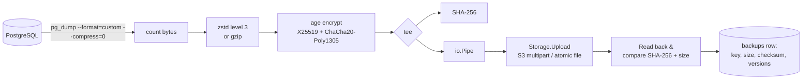

# Backup engine

The backup engine (`backend/internal/backups/engine.go`) turns a PostgreSQL database into
an encrypted, checksummed object in storage, in one streaming pass.



## Steps

1. **Connect & inspect.** The worker connects with the stored credentials (decrypted in
   memory), records the server version, database size and table count, and logs
   `Connection successful (PostgreSQL 17.2, 482 MB, 12 tables)`.
2. **Version check.** `pg_dump` refuses to dump servers newer than itself, so the engine
   checks the client's major version first and fails with an actionable message. The Docker
   image ships PostgreSQL 18 client tools, which dump servers 9.2 through 18.
3. **Dump.** `pg_dump --format=custom --compress=0 --no-password --lock-wait-timeout=60000`.
   Custom format lets `pg_restore` restore selectively and in dependency order; built-in
   compression is disabled because DBVault compresses the stream itself.
4. **Compress.** zstd (default, level 3, bounded 8 MiB window) or gzip, or none.
5. **Encrypt.** age with the organization's public key. Encryption can be turned off per
   schedule, and the UI warns when it is.
6. **Checksum.** A SHA-256 is computed over exactly the bytes that are stored.
7. **Upload.** The storage backend consumes the pipe (see [storage.md](storage.md)).
8. **Verify the upload.** With `VERIFY_UPLOADED_DATA=true` (default) the object is streamed
   back and its SHA-256 and size compared before the backup is marked `completed`.
   Otherwise the object's size is checked.
9. **Record.** Key, sizes, checksum, PostgreSQL and pg_dump versions, table count and
   duration are stored; an audit entry is written; `backup.succeeded` notifications fire;
   retention cleanup and (optionally) a restore verification are queued.

## Failure handling

- The producer waits for `pg_dump` to exit **before** writing the final compression and
  encryption frames. If `pg_dump` failed, the pipe is closed with that error, so the upload
  fails and no truncated backup can ever be stored as complete.
- If the upload fails, `pg_dump` is killed immediately (the pipe would otherwise block it)
  and the partial object is removed (multipart uploads are aborted, local temp files
  deleted).
- The error recorded on the backup is the root cause (for example `pg_dump failed:
  permission denied for table secrets` or `storage: upload: …`), and storage failures also
  trigger the `storage.failed` notification.
- Errors are phrased for humans: authentication failures, timeouts, unknown hosts, TLS
  problems and permission errors are recognized and explained.

## Memory and disk

Each stage is an `io.Reader`/`io.Writer`; nothing buffers the whole dump. Peak memory is
roughly one upload part (16 MiB) plus codec buffers: about 60 MB RSS was measured for a
358 MB database (302 MB of dump data). Backups never touch the worker's disk. Restores and
verifications download to `WORK_DIR` first so the checksum is verified before anything is
restored.

## Progress

The worker publishes progress (`phase`, `bytes_dumped`, `bytes_written`, estimated total)
to the job about once a second. The UI and CLI show it as a progress bar. The database's
on-disk size is only an estimate of dump size, so the bar is capped at 99% until the job
finishes.

## Logs

Every backup has a user-visible log, for example:

```
12:30:01 Connecting to PostgreSQL at db.internal:5432
12:30:03 Connection successful (PostgreSQL 17.2, 482.0 MB, 12 tables)
12:30:04 Starting pg_dump 18.6 (custom format)
12:30:04 Uploading to s3://dbvault-production
12:31:52 pg_dump completed (3.4 GB of dump data)
12:31:52 Compression completed with zstd (482.0 MB, 7.2x)
12:31:52 Encryption completed (age X25519 + ChaCha20-Poly1305)
12:32:17 Upload completed (482.0 MB)
12:32:18 Checksum verified (sha256:9f2c4e1a…)
12:32:18 Backup completed in 2m17s
```

## Retention

Retention (`backend/internal/retention`) is a pure grandfather-father-son planner: keep
the newest backup of each of the last *N* days, ISO weeks and months that have backups. It
applies only to **scheduled** backups of that schedule; manual backups are never deleted
automatically. Safety rules:

- the plan is recomputed inside the cleanup job from the database, never taken from input;
- a per-schedule advisory lock prevents concurrent cleanups;
- the newest backup and anything younger than one hour are always kept;
- backups used by a running restore or verification are skipped;
- a policy of 0/0/0 keeps everything;
- the artifact is deleted from storage first; the record is kept (status `deleted`, with the
  reason) for history and auditing.

The schedule page shows a live preview of exactly which backups would be kept or deleted,
and why.

## Concurrency

A database can have at most one backup queued or running at a time; a second request gets
`409 Conflict`, and a scheduled run that finds one in progress is skipped (and logged).
Workers process up to `WORKER_CONCURRENCY` jobs each; add workers to scale out.
