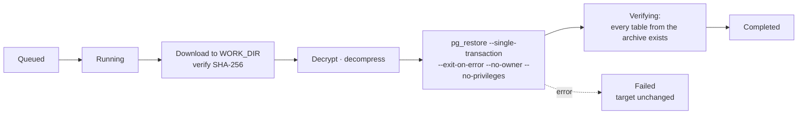

# Restore & verification

## Restoring a backup

Restores run as jobs on the worker. From the dashboard (*Restore*), the CLI
(`dbvault restore`) or the API (`POST /api/restores`), choose:

1. the **backup** (any completed backup; backups of a removed database stay listed under *Backups* and can be restored from there or via the API),
2. the **target** database server (any database registered in the organization),
3. the **mode**:
   - **New database** (safe): DBVault runs `CREATE DATABASE <name>` on the target server and
     restores into it. The target user needs `CREATEDB`. If the restore fails, the new
     database is dropped again.
   - **Existing database** (destructive): objects contained in the backup are dropped and
     recreated (`pg_restore --clean --if-exists`). The API refuses unless the request
     includes `"confirmation": "RESTORE"`; the dashboard and CLI make you type it.

Then the job:



Because the restore runs in a **single transaction** with `--exit-on-error`, it is
all-or-nothing: if anything fails (or you cancel), PostgreSQL rolls back and the target is
exactly as it was. Ownership and privileges are not restored because roles usually differ
between environments; objects are owned by the restoring user.

Statuses: `queued → running → verifying → completed` or `failed`/`cancelled`. Each restore
has a live log and an audit entry, and sends `restore.completed` / `restore.failed`
notifications.

### Restoring without DBVault

Backups are standard formats. With the organization's recovery key (exported from
*Settings → Security*):

```bash
age -d -i recovery.key backup.dump.zst.age | zstd -d > backup.dump   # .gz → gunzip
pg_restore --no-owner --no-privileges --single-transaction -d mydb backup.dump
```

Or download a decrypted `.dump` from the backup page (admins).

## Verifying a backup

*Verify backup* is a full recovery drill that proves a backup can be restored:

1. **Download** the artifact.
2. **Verify** its SHA-256 against the value recorded at backup time.
3. **Decrypt** it (age authenticates every 64 KiB chunk, so tampering is detected).
4. **Decompress** it and read its table of contents with `pg_restore --list`.
5. **Start** a disposable PostgreSQL.
6. **Restore** the backup into it.
7. **Query**: confirm every table from the archive exists and run `count(*)` on each.
8. **Record** the result on the backup.
9. **Destroy** the sandbox, always, even on failure or cancellation.

The report looks like this:

```
Backup integrity         PASS
Restore test             PASS
Database verification    PASS
Recovery test duration   2m 41s
```

Each check can be `pass`, `fail`, `skipped` or `unavailable`. A backup is marked
**verified** only when all three passed. Schedules can run verification automatically after
every backup (`verify_after_backup`), and failures send `verification.failed`
notifications.

### Sandbox modes (`VERIFY_MODE`)

| Mode | How it works | Requirements |
|---|---|---|
| `server` (Compose default) | Creates `dbvault_verify_<random>` on a dedicated server for the backup's engine (`VERIFY_POSTGRES_URL`, `VERIFY_MYSQL_URL`, `VERIFY_MARIADB_URL`: the bundled `verify-postgres`, `verify-mysql` and `verify-mariadb` services), then drops it. | Servers that hold nothing else, at least as new as your backups' server versions. Engines without a URL report restore testing as unavailable. |
| `docker` | Starts a container matching each backup's engine and major version (`postgres:<major>-alpine`, overridable with `VERIFY_DOCKER_IMAGE`; `mysql:<major>`; `mariadb:<major>`), restores into it, removes the container and its volumes. Stale containers from crashed workers are cleaned up on start. | Access to the Docker socket (`docker-compose.verify-docker.yml`). Root-equivalent: use on dedicated hosts only. |
| `disabled` | Integrity checks (checksum, decryption, archive readability) still run. | — |

When restore testing can't run (mode disabled, Docker unreachable, sandbox server too old),
the report says **"Restore testing unavailable in this environment"** with the reason, the
backup's status is `unavailable`, and it is **never** shown as verified. The dashboard
sidebar and `dbvault status` show whether restore testing is currently available.

Enable Docker mode with:

```bash
echo "DOCKER_GID=$(stat -c %g /var/run/docker.sock)" >> .env
docker compose -f docker-compose.yml -f docker-compose.verify-docker.yml up -d
```

## Recommended practice

- Turn on automatic verification for your most important schedules.
- Periodically restore into a new database and point a staging environment at it: that's
  the best test of all.
- Keep at least one restore rehearsal in your runbook, including decrypting a backup with
  the recovery key and the standard `age` CLI.
