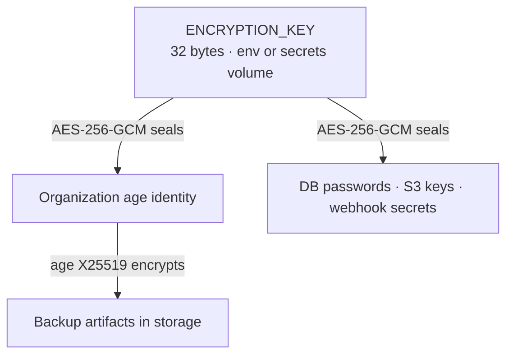

# Security

DBVault holds database credentials and copies of production data. This document describes
how it protects them, and what you must do as an operator.

## Threat model (summary)

| Asset | Protection |
|---|---|
| Database passwords, storage keys, webhook URLs & signing secrets | AES-256-GCM with `ENCRYPTION_KEY`, per-row associated data, never returned by the API, never logged |
| Backup contents | age encryption (X25519 + ChaCha20-Poly1305) before upload; storage only sees ciphertext |
| Backup encryption keys | Per-organization age identities, sealed with `ENCRYPTION_KEY` |
| User accounts | argon2id password hashes; optional TOTP two-factor authentication with recovery codes; opaque server-side sessions; rate limiting |
| Tenancy | Every query scoped by organization; non-members get 404 |
| Instance admin | Read-only, GET-only, browser sessions only; never sees credentials, storage config or backup contents; every organization view is audited in that organization |
| Integrity | SHA-256 recorded at backup time, verified after upload and before every restore |

## Key management



- **`ENCRYPTION_KEY`** (master key) is 32 random bytes, base64-encoded, provided through the
  environment or generated once into the `dbvault-secrets` volume (`secrets.env`, mode
  0600). It never touches the database.
- Each **organization** gets its own age X25519 key pair on creation. The public key
  encrypts backups; the private key is stored sealed by the master key and only unsealed in
  memory by the worker (to restore/verify) or the API (decrypted downloads).
- Sealed values bind their purpose as AES-GCM associated data (for example
  `database:<id>:password`), so a ciphertext copied into another row or column fails to
  decrypt.

**Operator responsibilities**

1. Back up `ENCRYPTION_KEY` somewhere other than the DBVault host (a password manager or
   secrets manager). Losing it makes every stored credential and backup key unrecoverable.
2. Export each organization's **recovery key** (*Settings → Security → Export recovery key*,
   owner only, password re-prompt, audited) and store it offline. With it you can decrypt
   backups using only standard tools:

   ```bash
   age -d -i recovery.key backup_2026-09-19_12-30-00.dump.zst.age | zstd -d > backup.dump
   pg_restore --no-owner -d mydb backup.dump
   ```

3. **Rotating `ENCRYPTION_KEY`** currently requires re-sealing stored secrets; treat it as
   long-lived and protect it accordingly (planned: a `dbvault-admin rotate-key` command).

## Authentication

- Passwords: argon2id (`m=19 MiB, t=2, p=1`, per OWASP), minimum 10 characters, parameters
  encoded in each hash so they can be raised later. Unknown emails are verified against a
  dummy hash so response times don't reveal which accounts exist.
- Sessions: 256-bit random tokens in an `HttpOnly`, `SameSite=Lax` cookie (`Secure` when
  `APP_URL` is https). Only an HMAC-SHA256 of each token (keyed with `AUTH_SECRET`) is
  stored, so a database leak doesn't expose usable sessions. 14-day sliding expiry; logout
  and password changes revoke sessions.
- API tokens (`dbv_…`) for the CLI: shown once, hashed like sessions, revocable, optional
  expiry.
- Password reset: single-use, 1-hour, hashed tokens sent by email; the response never
  reveals whether an account exists; all sessions are revoked on reset.

### Two-factor authentication

Users can turn on TOTP two-factor authentication (RFC 6238: SHA-1, 6 digits, 30 seconds,
which every authenticator app supports) under **Settings → Security**.

- Setup re-checks the password, then shows a QR code and the base32 secret. Nothing changes
  until the user enters a valid code; enabling signs out every other session.
- The TOTP secret is sealed with `ENCRYPTION_KEY` (associated data `user:<id>:totp`). Codes
  are accepted one step either side of now, and each accepted time step is recorded, so a
  code can't be replayed.
- Sign-in with 2FA is two requests. A correct password returns a short-lived challenge
  token (`dbvm_…`, 5 minutes, hashed at rest, at most 5 code attempts) instead of a session.
  The session cookie is only set once a valid code is presented.
- Ten single-use recovery codes are issued when 2FA is enabled and can be regenerated.
  Only HMAC-SHA256 digests (keyed with `AUTH_SECRET`, scoped to the user) are stored.
- Turning 2FA off or regenerating recovery codes needs the password **and** a current code
  or recovery code, and only works from a browser session. A leaked API token can't do
  either.
- `dbvault init` sends the code with the password when the server asks for one. Existing
  API tokens keep working after 2FA is enabled; revoke any you don't recognize.
- Password reset by email does **not** turn off 2FA, so control of someone's mailbox isn't
  enough to take over their account.

**Lost authenticator and recovery codes.** An operator with database access can turn
2FA off for one account, after verifying the person's identity out of band:

```sql
BEGIN;
UPDATE users SET totp_secret_encrypted = NULL, totp_enabled_at = NULL, totp_last_step = NULL
  WHERE email = 'person@example.com';
DELETE FROM user_recovery_codes WHERE user_id = (SELECT id FROM users WHERE email = 'person@example.com');
COMMIT;
```

## Request protection

- **CSRF**: cookie-authenticated mutations must carry `X-CSRF-Token`, an HMAC of the session
  id (signed double-submit). Additionally, unsafe requests with a body must be
  `application/json` and any `Origin` header must equal `APP_URL`. Bearer-token requests are
  exempt because browsers never attach them automatically.
- **Rate limiting** (Redis, shared across replicas): per-IP limits on login/registration,
  per-email login limits, and a general per-user API limit.
- **Input validation** on every endpoint; unknown JSON fields are rejected; bodies are
  capped at 1 MiB. All SQL uses bind parameters. Identifiers DBVault creates (restore
  database names) are validated and quoted with `pgx.Identifier`.
- **Errors**: unexpected errors return a generic message with a request id; details go to
  the server log only. No stack traces reach clients.
- **Headers**: `X-Content-Type-Options`, `X-Frame-Options: DENY`, `Referrer-Policy`, a
  restrictive CSP on API responses, `Cache-Control: no-store` on API responses.

## Authorization

| Role | Can |
|---|---|
| Viewer | Read everything except secrets |
| Member | + run backups, verify backups, test connections, cancel jobs, download encrypted artifacts |
| Admin | + manage databases, storage, schedules, notifications; restore; delete backups; download decrypted dumps; invite members |
| Owner | + change owner/admin roles, export the recovery key. An organization always keeps at least one owner. |

Resources of other organizations return `404` rather than `403`, so ids can't be probed.

### Instance admin

Accounts whose email is listed in `INSTANCE_ADMIN_EMAILS` get a separate, read-only view of the
whole installation (`/admin`, API under `/api/admin`): every organization with its members,
databases, storage destinations, schedules, recent backups and audit log, plus all users.

- It grants **no** role inside any organization: `X-DBVault-Org` still requires membership.
- Only `GET` is accepted. There is nothing to change, run, restore or download.
- Database usernames and passwords, TLS certificates, storage configuration and credentials,
  notification targets and backup contents are never returned.
- Only browser sessions qualify. An API token never carries it, even for an admin's account.
- Everyone else gets `404` for the whole area, so it can't be discovered.
- Opening an organization writes `admin.organization_viewed` to *that organization's* audit log
  (at most once per admin every 30 minutes), so its members can see who looked.

## Running pg_dump and pg_restore safely

- No shell is ever involved: binaries are executed directly with fixed arguments.
- Connection details are passed in the child's environment (`PGHOST`, `PGPASSWORD`, …),
  never in argv (visible to every local user via `ps`). The database name for restores is
  passed through `PGDATABASE` so it can't be interpreted as a connection string.
- Child processes get a minimal environment: DBVault's own secrets are not inherited.
- Processes run in their own process group and are killed as a group on cancellation.
- CA certificates for `verify-ca`/`verify-full` are written to private temp files and
  removed afterwards.

## SQLite files

SQLite databases are read from and restored into the folder named by `SQLITE_ROOT` (mounted
from `SQLITE_HOST_DIR` in Compose). Paths are relative to it; absolute paths, `..`
segments and symlinks that resolve outside it are rejected on every access, so a database
entry can't reach other files on the host. The folder is shared by every organization on
the instance: any organization admin can add, back up and restore any file in it. Leave
`SQLITE_ROOT` unset (or the folder empty) on multi-tenant instances unless every tenant
should have that access.

## Network egress (SSRF)

Self-hosted DBVault needs to reach private networks (that's where databases live), so
`ALLOW_PRIVATE_NETWORK_TARGETS=true` by default. For multi-tenant/hosted deployments set it
to `false`: webhooks then refuse loopback, private, link-local and multicast addresses, and
redirects are never followed. Connection tests and storage tests are admin-only.

## Logging

Logs are structured JSON. The log handler redacts attributes whose names contain
`password`, `secret`, `token`, `key`, `authorization`, `cookie` or `credential`. Request
logs record the path only (never query strings, bodies or headers). Webhook URLs are
scrubbed from error messages.

## Restore testing isolation

- `VERIFY_MODE=server` (default in Compose) restores into a throwaway database on the
  dedicated `verify-postgres` container, which holds nothing else and isn't published.
- `VERIFY_MODE=docker` starts one container per test. It requires mounting the Docker
  socket into the worker, which is root-equivalent on the host. Only enable it on hosts
  dedicated to DBVault (`docker-compose.verify-docker.yml`).

## Audit log

Append-only records of: registration, logins and failed logins, logout, password changes
and resets, two-factor enable/disable, failed codes, recovery-code use and regeneration,
API token creation/revocation, organization changes, invitations and role
changes, recovery-key export, database/storage/schedule/notification changes, connection
tests, backup start/completion/failure/deletion/download/expiry, verification results,
restores and job cancellations. Entries include the actor, IP and user agent; metadata keys
that look sensitive are dropped.

## Deployment checklist

- [ ] Serve DBVault over HTTPS (reverse proxy or load balancer) and set `APP_URL=https://…`.
- [ ] Generate secrets with `./scripts/setup.sh` and back up `ENCRYPTION_KEY`.
- [ ] Export each organization's recovery key and store it offline.
- [ ] Set `ALLOW_REGISTRATION=false` after creating your account; invite teammates.
- [ ] If you set `INSTANCE_ADMIN_EMAILS`, register those accounts first: the role follows the
      email address, so whoever registers it gets the installation-wide view.
- [ ] Use a least-privilege database role for backups (`pg_read_all_data` on PostgreSQL 14+).
- [ ] Use a dedicated, versioned (ideally object-locked) bucket and a scoped access key.
- [ ] Keep the API, PostgreSQL and Redis off the public internet (the default compose file does).
- [ ] Configure SMTP and a notification channel for `backup.failed` and `verification.failed`.
- [ ] Schedule automatic restore verification (`verify_after_backup`) for critical databases.

Report vulnerabilities privately — see [SECURITY.md](../SECURITY.md).
